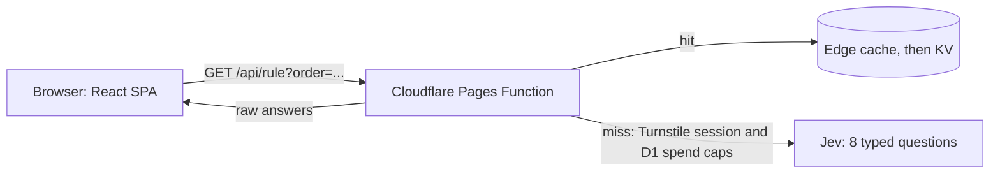

# Bagel Review Board

[](https://github.com/ctsstc/typesafe-ai-uptech-bagel-policy/actions/workflows/ci.yml)

Describe a bagel order and get a ruling under the [Uptech Studio Bagel Policy](https://www.uptechstudio.com/bagels). Jev, a model from [TypeSafe](https://typesafe.ai/), sorts the bagel, the cream cheese and the worst topping into the policy's tiers. The worst tier sets the verdict: Proper, Acceptable, Borderline, Violation or Just stop. Sandwiches and sun-dried tomatoes get their own flags.

**Try it at https://bagel-review-board.pages.dev**

> [!NOTE]
> Made by an Uptech employee, not an official Uptech product. It is not affiliated with or endorsed by TypeSafe.

## Credits

- **The Bagel Policy** is [Uptech Studio's](https://www.uptechstudio.com/bagels). Go read the original.
- **Rulings** by Jev from TypeSafe (https://typesafe.ai/).
- **Made by** Cody Swartz ([GitHub](https://github.com/ctsstc), [LinkedIn](https://linkedin.com/in/codyswartz/)). Built with [Claude Code](https://claude.com/claude-code), on the same stack as the [Cube Rule Oracle](https://github.com/ctsstc/typesafe-ai-cube-rule).

## How it works



- **One request, 8 typed questions.** Jev is a System One model: it returns probabilities, never text. Each new order asks for the bagel, cream cheese and worst topping tiers, whether it is a sandwich, whether sun-dried tomatoes are involved, what kind of input it is, whether it is abusive, and how scandalized the office would be.
- **Raw answers, mapped in code.** The browser turns Jev's answers into a ruling with `toPolicyResult` from `packages/core`, so thresholds and copy change without new inference.
- **Cached, so repeats are free.** A ruling is keyed by order and question set version and kept in the browser, Cloudflare's edge cache and KV.
- **A human check and spend caps guard the bill.** A new order needs a Cloudflare Turnstile session. Before each Jev call, D1 counts it against the session (60), the network for the UTC day (150, stored only as a keyed hash) and the whole day (1,000). The Function fails closed.
- **Share links.** Every ruling has its own URL, `/?order=...`.

## Quick start

Needs Node 22.13 or later (even releases) and pnpm 10. `corepack enable` picks up the pinned pnpm version.

```sh
pnpm i
cp .env.example .env
pnpm dev
```

Open http://localhost:5173. With `TYPESAFE_API_KEY` empty, the Function serves keyword-based mock rulings and the card is marked simulated. For live rulings, create a key at https://console.typesafe.ai/keys. Each new order is one Jev call of about 2,800 input tokens, roughly $0.00012.

> [!IMPORTANT]
> The key belongs only in the root `.env` (gitignored) locally and in a Pages secret in production. `apps/web/src/bundle.test.ts` fails `pnpm check` if the bundle contains the TypeSafe API host, the SDK or question text.

## Commands

| Command | Does |
| --- | --- |
| `pnpm dev` | Vite on 5173 and the Function on 8788 |
| `pnpm dev:challenge [pass\|interactive\|fail\|spent] [--preview]` | Like `pnpm dev`, with the human check on, using Cloudflare's test keys |
| `pnpm check` | Typecheck, Biome lint and every Vitest project. CI runs this with no key and no network |
| `pnpm eval` | Runs the labelled order set against Jev, within a fixed budget (see below) |
| `pnpm deploy:pages` | Guarded production deploy. Bare `pnpm deploy` is pnpm's own command |
| `pnpm spend [--detail]` | Read-only Jev spend report from the production D1 counters |

## Evaluation

`eval/` holds 190 labelled orders: canon from the policy page and three office incidents, plus tune and holdout orders built around ingredients the policy never names. On question set 3 with `jev-1.13.0`:

| Split | Verdict right |
| --- | --- |
| Canon (policy page and office incidents) | 48/51 |
| Tune, which the questions were rewritten against | 68/76 |
| Holdout, looked at only for the final candidate | 61/63 |

A full pass costs about $0.02, and the runner refuses to spend past a fixed total. [docs/eval.md](docs/eval.md) explains how the labels were made and records every tuning round.

## Deploying your own

One Cloudflare Pages project with a KV namespace, a D1 database and a Turnstile widget. [docs/deploy.md](docs/deploy.md) walks through the one-time setup, the deploy script's guards, rollback, caching and spend limits. A fork has to point `apps/web/src/lib/links.ts` and the project names in `scripts/deploy.sh` at its own repo and Cloudflare account.

## Project layout

```text
packages/core/   Policy tiers, Jev questions, input normalization, result mapping, mock, wire types
apps/web/        React SPA, Pages Functions (rule.ts, session.ts), D1 migrations, Vite mock API plugin
eval/            Labelled orders, the budgeted eval harness and results per question set
scripts/         pages-dev.sh and dev-challenge.sh (local wrangler), deploy.sh, cloudflare-config.mjs, spend.mjs
docs/            eval.md (tuning rounds) and deploy.md (Cloudflare runbook)
```

## License

[MIT](LICENSE) covers this project's code, eval harness and eval labels. The Bagel Policy belongs to Uptech Studio (UpTech Works, LLC), and the names Uptech, Uptech Studio, TypeSafe and Jev belong to their owners; none of them are part of that grant. [NOTICE](NOTICE) spells this out.

Release notes are in [CHANGELOG.md](CHANGELOG.md).
